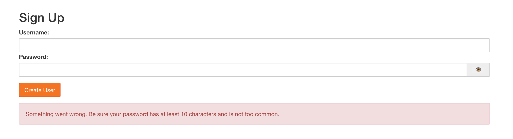
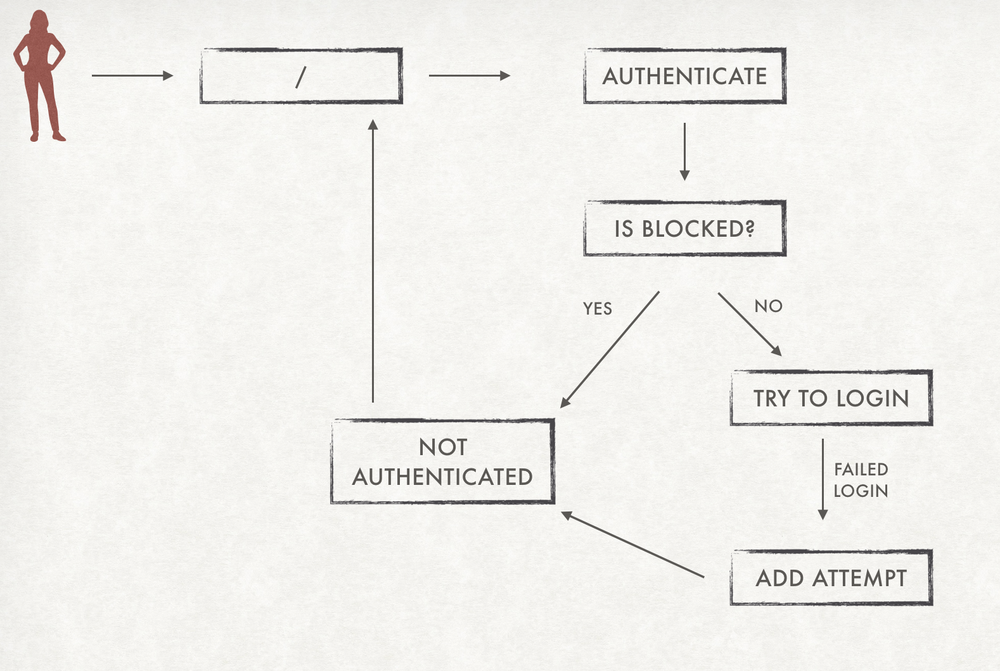
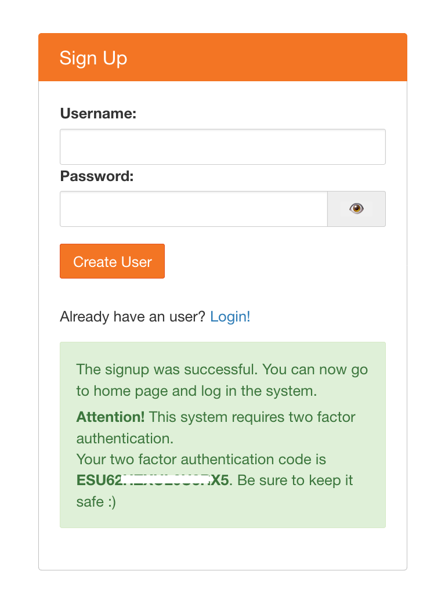

Optional Configuration
======================

Password Strength
-----------------

By default, when a user signs up through Native Authenticator there is no password strength verification, so any type of password is valid. There are two methods that you can add to increase password strength: a verification for commmon passowords and a minimum length of password. 

To verify if the password is not common (such as 'qwerty' or '1234'), you can add the following line to your config file:

.. code-block:: python

    c.Authenticator.check_common_password = True

The Authenticator will verify if the password is a common password and the user won't be able to sign up if it is. The list of the common passwords that are in our verification is available `on this link <https://github.com/danielmiessler/SecLists/blob/master/Passwords/Common-Credentials/10-million-password-list-top-10000.txt>`_ >._  

You can also add a minimum password length that the user must have. To do this add the following line on the config file with an integer as a value:

.. code-block:: python

    c.Authenticator.minimum_password_length = 10

If any of this configuration is available, the user will receive this message on SignUp:

Block users after failed logins
-------------------------------

One thing that can make systems more safe is to block users after a number of failed logins. With Native Authenticator you can add this feature by adding `allowed_failed_logins` on the config file. The default is 0, which means that the system will not block users ever.

.. code-block:: python

    c.Authenticator.allowed_failed_logins = 3

You can also define the number of seconds a user must wait before trying again. The default value is 600 seconds.

.. code-block:: python

    c.Authenticator.seconds_before_next_try = 1200

Disable SignUp
--------------

By default Native Authenticator allows everyone to register user accounts. But you can add a option to disable signup. To do so, just add the following line to the config file:

.. code-block:: python

    c.Authenticator.enable_signup = False

Open SignUp
-----------

By default all users that make sign up on Native Authenticator need an admin approval so 
they can actually log in the system. You can change this behavior by adding an option of 
open signup, where all users that do sign up can already log in the system. To do so, just add this line to the config file:

.. code-block:: python

    c.Authenticator.open_signup = True

Ask for extra information on SignUp
-----------------------------------

Native Authenticator is based on username and password only. But if you need extra information about the users, you can add them on the sign up. For now, the only extra information you can ask is email. To do so, you can add the following line on the config file:

.. code-block:: python

    c.Authenticator.ask_email_on_signup = True

Import users from FirstUse Authenticator
----------------------------------------

If you are using `FirstUse Authenticator <https://github.com/jupyterhub/firstuseauthenticator>` and wish to change to Native Authenticator, you can import users from that authenticator to Native authenticator with minimum work!

To do so, you have to add the following line on the configuration file:

.. code-block:: python

    c.Authenticator.import_from_firstuse = True

**Remark: unless you have configured the open signup configuration, the users will be created but they will not be able to login, because they don't have authorization by default.**

By default, Native Authenticator assumes that the path for the database is the same directory. If that's not the case, you can change the path the file through this variables:

.. code-block:: python

    c.Authenticator.firstuse_dbm_path = '/home/user/passwords.dbm'

Native Authenticator ensures that usernames are sanitized, so they won't have commas 
or white spaces. Additionaly, you can add password verification such as 
avoiding common passwords. If usernames or passwords imported from the 
FirstUse Authenticator don't comply with these verifications, the importating will raise an 
error.

You can also remove FirstUse's database file after the importation to Native Authenticator, to avoid leaving unused files on the system. To do so, you must add the following line to the configuration file:

.. code-block:: python

    c.Authenticator.delete_firstuse_db_after_import = True

Add two factor authentication obligatory for users
--------------------------------------------------

You can increase security making two factor authentication obligatory for all users.
To do so, add the following line on the config file:

.. code-block:: python

    c.Authenticator.allow_2fa = True

Users will receive a message after signup with the two factor authentication code:  

And login will now require the two factor authentication code as well:

.. image:: _static/login-two-factor-auth.png
