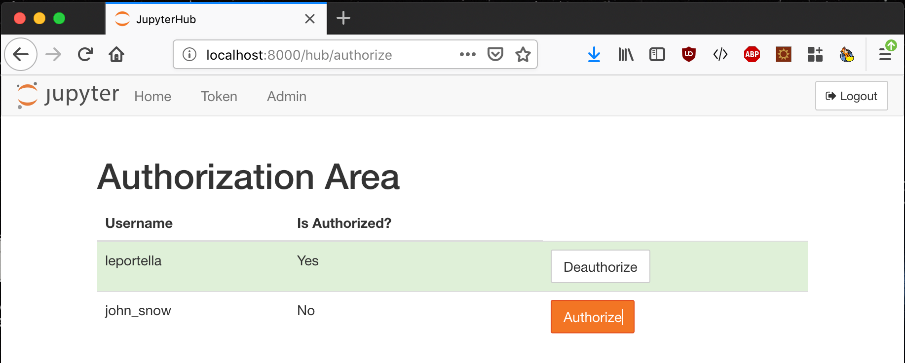
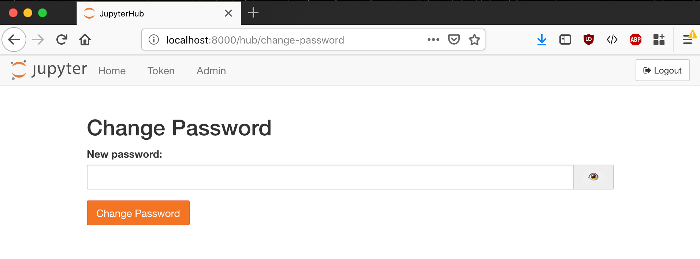

Quickstart
==========

Installation
------------

Native Authenticator is a plugin Authenticator for the `JupyterHub <https://github.com/jupyterhub/>`_. 

You must install this authenticator throught the project's repository. This is
a temporary solution until we have the package on the `Pypi <https://pypi.org/>`_:

.. code-block:: bash

   $ git clone https://github.com/jupyterhub/nativeauthenticator.git
   $ pip install -e .

Then, you must create the configuration file for JupyterHub:

.. code-block:: bash

    $ jupyterhub --generate-config -f /etc/jupyterhub/jupyterhub_config.py

And change the default Authenticator class for the Native Authenticator class:

.. code-block:: python

    c.JupyterHub.authenticator_class = 'nativeauthenticator.NativeAuthenticator'

You can then run JupyterHub using the config file and the NativeAuthenticator will be running the system:

.. code-block:: bash

    $ jupyterhub -f /etc/jupyterhub/jupyterhub_config.py

Default workflow
----------------

A new user that wants access to a system running the Native Authenticator must enter the SignUp page and create a new username and password. By default, this user will not have access to the system, they will the authorization of an admin to actually be able to login the system. Thus, when making the signup the user will receive a message letting them know that their information was sent to an admin. 

.. image:: _static/native_auth_flow.png

The admin must acces the authorization panel and authorize the user so they be able to login:

Adding new users
----------------

To create a new user one must fo to  `/hub/signup` and create a username and a password. The information on the signup can change depending on admin configuration and are all obligatory.  By default, when a new user is created on the system it will need an Admin authorization to access the system. 

It is important to notice that admin must also create a new user through signup. However, usernames list in the config file as admins will automatically have authorization to enter the system. 

.. code-block:: python

    c.Authenticator.admin_users = {'username'}

Usernames restrictions
----------------------

Usernames can't contain commas, whitespaces, slashes or be empty. If any of these are in the username on signup, the user won't be able to do the signup. 

Authorize or unauthorize users
------------------------------

To authorize new users to enter the system or to manage those that already have access to the system you can go to `/hub/authorize`. Authorized users will have a green background with a button for unauthorize them while unauthorized users will have a white background and an authorization button. 

Change password
---------------

Users that are logged in the system can easily change their password by going to: `/hub/change-password`.

