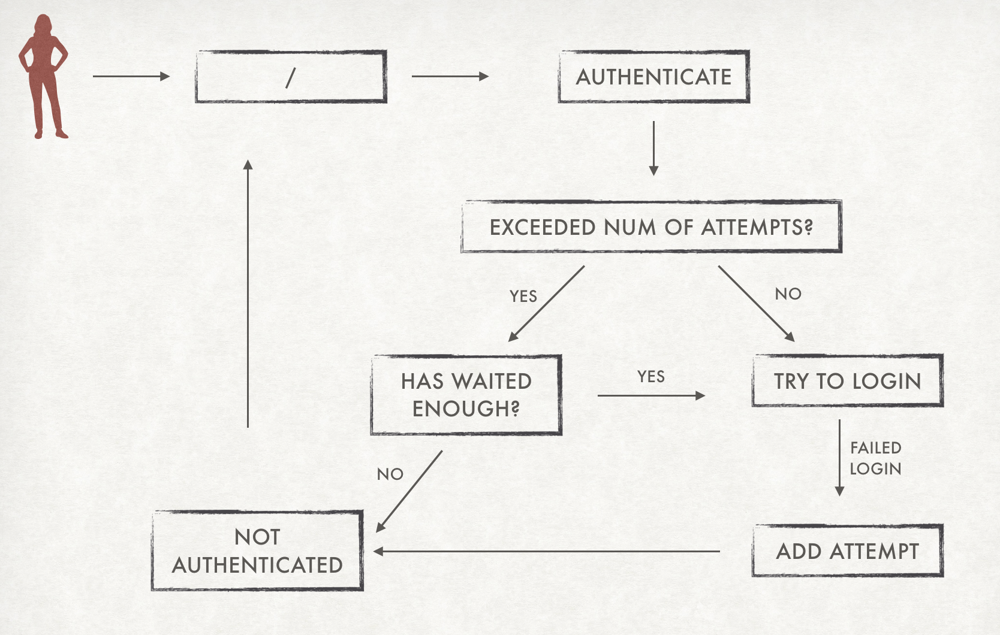
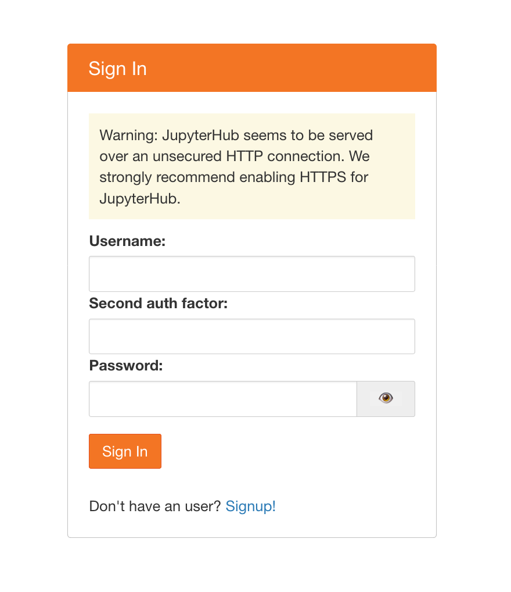

# Optional Configuration

## Password Strength

By default, when a user signs up through Native Authenticator there is no password strength verification, so any type of password is valid. There are two methods that you can add to increase password strength: a verification for commmon passowords and a minimum length of password.

To verify if the password is not common (such as 'qwerty' or '1234'), you can add the following line to your config file:

```python
c.NativeAuthenticator.check_common_password = True
```

The Authenticator will verify if the password is a common password and the user won't be able to sign up if it is. The list of the common passwords that are in our verification is available [on this link](https://github.com/danielmiessler/SecLists/blob/master/Passwords/Common-Credentials/10-million-password-list-top-10000.txt).

You can also add a minimum password length that the user must have. To do this add the following line on the config file with an integer as a value:

```python
c.NativeAuthenticator.minimum_password_length = 10
```

If any of this configuration is available, the user will receive this message on SignUp:


## Block users after failed logins

One thing that can make systems more safe is to block users after a number of failed logins. With Native Authenticator you can add this feature by adding `allowed_failed_logins` on the config file. The default is 0, which means that the system will not block users ever.

```python
c.NativeAuthenticator.allowed_failed_logins = 3
```

You can also define the number of seconds a user must wait before trying again. The default value is 600 seconds.

```python
c.NativeAuthenticator.seconds_before_next_try = 1200
```



## Disable SignUp

By default Native Authenticator allows everyone to register user accounts. But you can add a option to disable signup. To do so, just add the following line to the config file:

```python
c.NativeAuthenticator.enable_signup = False
```

## Open SignUp

By default all users that make sign up on Native Authenticator need an admin approval so
they can actually log in the system. You can change this behavior by adding an option of
open signup, where all users that do sign up can already log in the system. To do so, just add this line to the config file:

```python
c.NativeAuthenticator.open_signup = True
```

## Ask for extra information on SignUp

Native Authenticator is based on username and password only. But if you need extra information about the users, you can add them on the sign up.
For now, the only extra information you can ask is email. To do so, you can add the following line to the config file:

```python
c.NativeAuthenticator.ask_email_on_signup = True
```

## Use reCaptcha to prevent scripted SignUp attacks

Since by default, anybody can sign up to the system, you may want to use the lightweight
single-click "I am not a robot" checkbox provided by Google's reCAPTCHA v2 to reduce your
risk from scripting attacks.
To use this feature, you will need to [register with reCaptcha](https://www.google.com/recaptcha/admin/create) (you will need a Google account to do so).

You can learn more about reCAPTCHA [here](https://developers.google.com/recaptcha/intro).
If you would like to simply test this functionality without creating an account, you can do
so as explained [here](https://developers.google.com/recaptcha/docs/faq#id-like-to-run-automated-tests-with-recaptcha.-what-should-i-do).
Note that this test in itself does not provide actual security so please do **NOT** use
these test credentials for your actual production system.

To enable reCAPTCHA on signup, add the following two lines to the configuration file and
substitute your own credentials.

```python
c.NativeAuthenticator.recaptcha_key = "your key"
c.NativeAuthenticator.recaptcha_secret = "your secret"
```

## Allow self-serve approval

By default, all users who sign up on NativeAuthenticator need a manual admin approval so they can actually log in the system. Or you can allow anybody without approval as described above with `open_signup`.
Alternatively, depending on your situation, you may want something _like_ `open_signup` but only for users in your own organization. This is what this option permits.

New users are still created as non-authorized, but they can self-authorize by navigating to a (cryptographically verified) URL which will be e-mailed to them _only_ if the provided email address matches the specified regular expression.

For example, to allow any users who have an `example.com` email address to self-approve, you add the following to your configuration file:

```python
c.NativeAuthenticator.allow_self_approval_for = '[^@]+@example\.com$'
```

Please note that activating this setting automatically also enables `ask_email_on_signup`.

To use the code, you must also provide a secret key (i.e. an arbitrary string, not too short) to cryptographically sign the URL. To prevents attacks, it is crucial that this key stays secret.

```python
c.NativeAuthenticator.secret_key = "your-arbitrary-key"
```

You should also customize the email sent to users with something as follows:

```python
c.NativeAuthenticator.self_approval_email = ("from", "subject", "email body, including https://example.com{approval_url}")
```

Note that you need to specify the domain where JupyterHub is running (`example.com` in the code block above) as well as the port, if you are using a non-standard one (e.g. `8000`).
Also the protocol must be the correct one you are serving your connections from (`https` in the example).

Furthermore, you may specify the SMTP server to use for sending the email. You can do that with

```python
c.NativeAuthenticator.self_approval_server = {'url': 'smtp.gmail.com', 'usr': 'myself', 'pwd': 'mypassword'}
```

If you do not specify a `self_approval_server`, it will attempt to use `localhost` without authentication.

Using GMail (as in the example above) is entirely optional, any other SMTP server accepting password authentication also works. However, if you _do_ wish to use GMail as your SMTP server, you must also allow "less secure apps" for this to work, as described at [this link](https://support.google.com/accounts/answer/6010255).
If you have 2FA enabled (with GMail, not NativeAuthenticator) you should disable it for JupyterHub to be able to send emails, as described [over here](https://support.google.com/accounts/answer/185833).
Also see [this helpful StackExchange post](https://stackoverflow.com/questions/16512592/login-credentials-not-working-with-gmail-smtp) for additional GMail-specific SMTP details.

Finally, the entire procedure so far will only correctly create and enable JupyterHub users.
However, the people wishing to login as this users, will **also** need to have accounts on the system that is running Jupyterhub. If the system is one of the more common Linux distributions, adding the following to the configuration file will automatically create their Linux account the first time they log in JupyterHub.
If the system where JupyterHub is running is another OS, such as BSD or Windows, the corresponding user creation command must be invoked instead of useradd with the appropriate arguments.

```python
def pre_spawn_hook(spawner):
    username = spawner.user.name
    try:
        import pwd
        pwd.getpwnam(username)
    except KeyError:
        import subprocess
        subprocess.check_call(['useradd', '-ms', '/bin/bash', username])

c.Spawner.pre_spawn_hook = pre_spawn_hook
```

## Mandatory acceptance of Terms of Service before SignUp

You may require that users to click a checkbox agreeing to your TOS before they can sign up. This might be legally binding in some jurisditions.
To do so, you only need to add the following line to your config file and provide a link the where users can find your TOS.

```python
c.NativeAuthenticator.tos = 'I agree to the <a href="your-url" target="_blank">TOS</a>'
```

## Import users from FirstUse Authenticator

If you are using [FirstUse Authenticator](https://github.com/jupyterhub/firstuseauthenticator) and wish to change to Native Authenticator, you can import users from that authenticator to Native authenticator with minimum work!

To do so, you have to add the following line on the configuration file:

```python
c.NativeAuthenticator.import_from_firstuse = True
```

**Remark: unless you have configured the open signup configuration, the users will be created but they will not be able to login, because they don't have authorization by default.**

By default, Native Authenticator assumes that the path for the database is the same directory. If that's not the case, you can change the path the file through this variables:

```python
c.NativeAuthenticator.firstuse_dbm_path = '/home/user/passwords.dbm'
```

Native Authenticator ensures that usernames are sanitized, so they won't have commas
or white spaces. Additionaly, you can add password verification such as
avoiding common passwords. If usernames or passwords imported from the
FirstUse Authenticator don't comply with these verifications, the importating will raise an
error.

You can also remove FirstUse's database file after the importation to Native Authenticator, to avoid leaving unused files on the system. To do so, you must add the following line to the configuration file:

```python
c.NativeAuthenticator.delete_firstuse_db_after_import = True
```

## Add two factor authentication obligatory for users

You can increase security making two factor authentication obligatory for all users.
To do so, add the following line on the config file:

```python
c.NativeAuthenticator.allow_2fa = True
```

Users will receive a message after signup with the two factor authentication code:


And login will now require the two factor authentication code as well:


