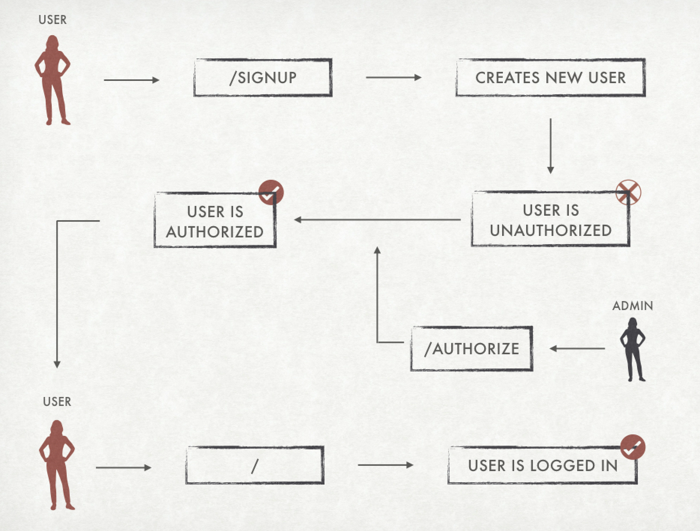
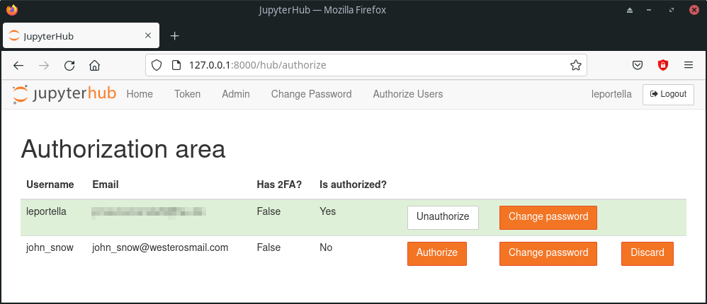
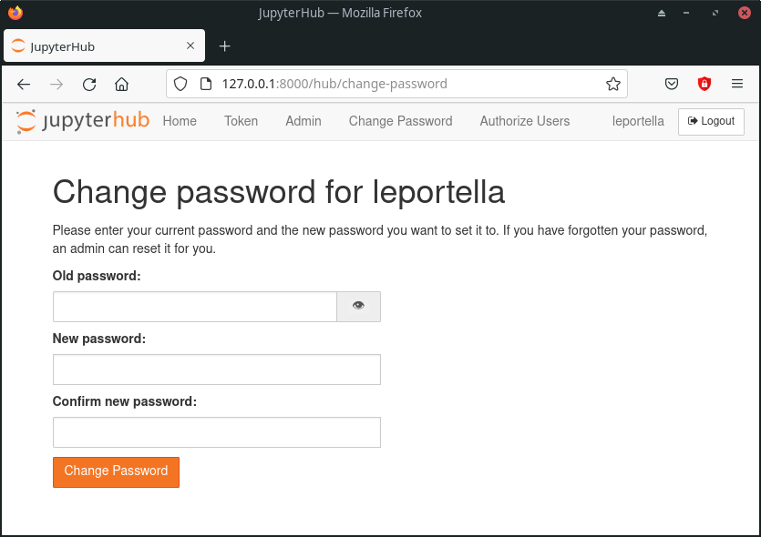
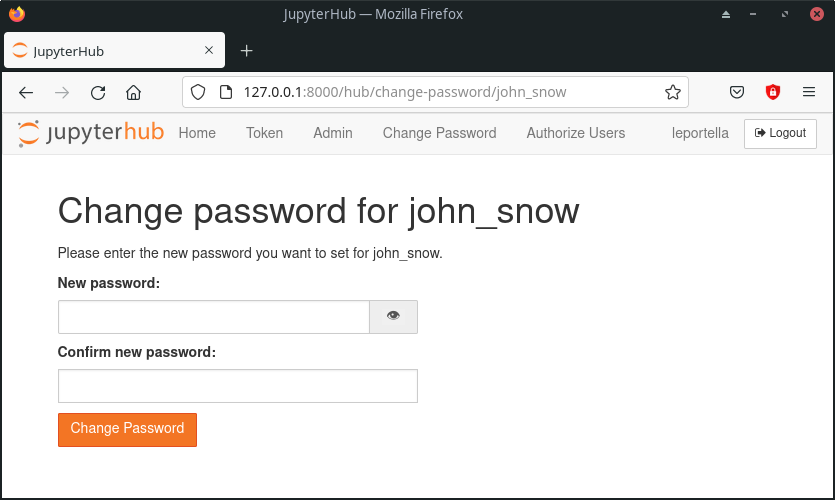

# Quickstart

## Installation

NativeAuthenticator is a authenticator plugin for [JupyterHub](https://github.com/jupyterhub/).

It is available on [PyPI](https://pypi.org/project/jupyterhub-nativeauthenticator/). The easiest way to install it is via pip:

```shell
pip install jupyterhub-nativeauthenticator
```

Alternatively, you can install this authenticator through the project's GitHub repository:

```shell
git clone https://github.com/jupyterhub/nativeauthenticator.git
cd nativeauthenticator
pip install -e .
```

After running the installation method of your choice, you must create the configuration file for JupyterHub:

```shell
jupyterhub --generate-config -f /etc/jupyterhub/jupyterhub_config.py
```

Also, change the default authenticator class to NativeAuthenticator:

```python
c.JupyterHub.authenticator_class = 'native'
```

Lastly, you need to add the following to the configuration file as well:

```python
import os, nativeauthenticator
c.JupyterHub.template_paths = [f"{os.path.dirname(nativeauthenticator.__file__)}/templates/"]
```

Now you can run JupyterHub using the updated configuration file and start using JupyterHub with NativeAuthenticator:

```shell
jupyterhub -f /etc/jupyterhub/jupyterhub_config.py
```

## Default workflow

A new user that wants access to a system running NativeAuthenticator must first visit the signup page and create a new account with a username and password. By default, this user will not have access to the system, they will need the authorization of an admin to actually be able to login the system. Thus, after executing the signup, the user will receive a message letting them know that their information was sent to an admin.



The admin must access the authorization panel and authorize the user so they be able to login:



## Adding new users

To create a new user one must go to `/hub/signup` and sign up with a username and a password. The information asked for on signup can change depending on admin configuration, but all fields are obligatory. By default, when a new user is created on the system they will need an administrator authorization to access the system.

It is important to note that **admin accounts must also be created through signup**. However, usernames listed in the config file as admins (see below) will automatically have authorization to enter the system.

```python
c.Authenticator.admin_users = {'username'}
```

## Username restrictions

Usernames cannot be empty or contain commas, spaces or slashes. If any of these apply, the user will receive an error and will not be able to sign up.

## Authorize, un-authorize or discard users

To authorize new users to enter the system or to manage those that already have access to the system you can go to `/hub/authorize` while logged in as an admin user. Alternatively, you can click the "Authorize Users" element on your home page. Authorized users will have a green background with a button to un-authorize them while un-authorized users will have a white background and an authorization button.


From here, you can also discard users that attempted to sign up but whom you do not want to authorize. Users that are discarded will not be notified.

To delete existing (authorized) users, first un-authorize and then discard them. Note that while discarding users will delete them from the database for both JupyterHub and NativeAuthenticator, **it will not delete data for accounts on the machine that is running JupyterHub!**  
Make sure to delete these separately, otherwise someone else could sign up with the same username later and inadvertently gain access to data that is not theirs.

## Changing your own password

Users that are logged in the system can easily change their password by going to: `/hub/change-password` or clicking the "Change Password" element on their home page.



## Changing a user's password as admin

In case any user forgets or misplaces their account password, admins can reset it to a password of their choosing. Simply navigate to `/hub/change-password/SomeUserName` or click the "Change Password" element of that user in the authorization area.


